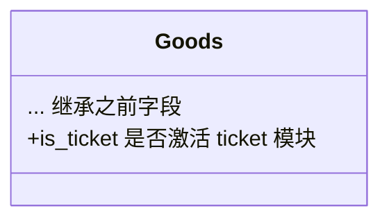
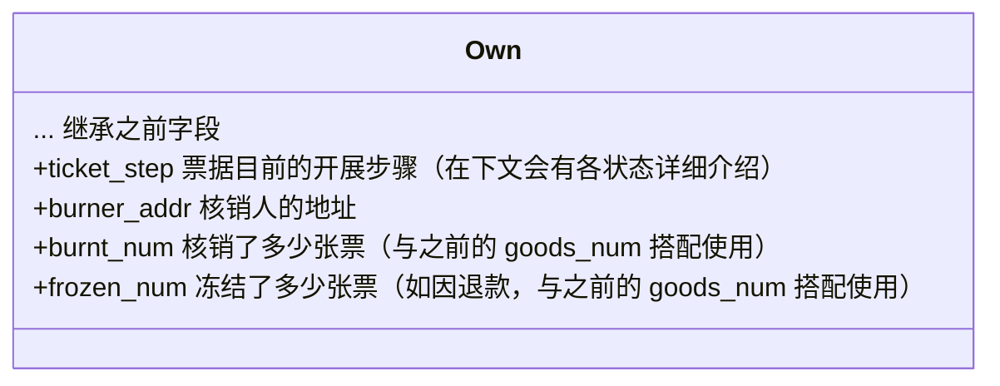
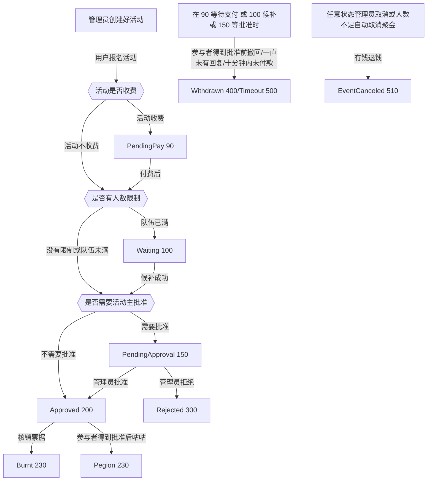

# DLC 1 - 可售卖票据 Ticket

第一个 DLC 是“可售卖票据”，它赋予了 Goods 以出售、核销票据的能力。从数据结构上看，Goods 会额外存在以下字段以实现 Ticket 模块：

对于 Own 数据表，会出现以下字段：

此时，一个 Own 可以理解为“一张票据”、“一张门票”。一个 Own 会根据状态有以下的票组步骤：

<table><thead><tr><th width="226">票组步骤值（ticket_step）</th><th>缩略意义</th><th>描述</th></tr></thead><tbody><tr><td>90</td><td>PendingPay</td><td>当前票正在等待用户付费</td></tr><tr><td>100</td><td>WaitingList</td><td>等待列表</td></tr><tr><td>150</td><td>PendingApproval</td><td>已支付，等待管理员通过审核</td></tr><tr><td>200</td><td>Approved</td><td>（常用）已通过，待使用状态</td></tr><tr><td>230</td><td>Burnt</td><td>验票完成，已销毁</td></tr><tr><td>300</td><td>Rejected</td><td>被管理员拒绝</td></tr><tr><td>400</td><td>Withdrawn</td><td>未通过审核前，被发起人主动撤回</td></tr><tr><td>410</td><td>Pigeon</td><td>已通过的票组，但是持票人主动取消</td></tr><tr><td>500</td><td>Timeout</td><td>超过审核时限/活动结束，仍未有一个审核结果</td></tr><tr><td>510</td><td>EventCanceled</td><td>活动取消</td></tr></tbody></table>

各个状态的转换流程图如下：

您也可以通过在线链接预览该图：



