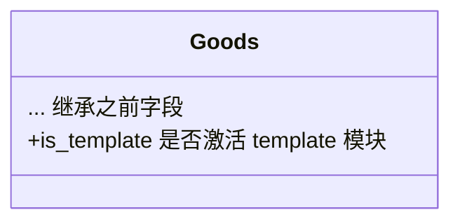

# DLC 2 - 可复制模板 Template

一些场景中，一个商品会作为“模板”反复运用，例如一条旅游路线、一个活动方案，用户每次仅需继承已有的描述、图片等信息，修改时间即可重复运用。

Goods 会额外存在以下字段以实现 Template 模块：

```mermaid
classDiagram
    Goods: ... 继承之前字段
    Goods: +is_template 是否激活 template 模块
```
