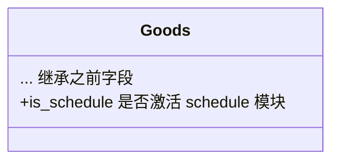

# DLC 3 - 可预约 Schedule

该 DLC 常常与 Template DLC 一同使用，一些商品可能会具备“预定”属性，例如一种服务、一个会议室等，他们需要用户通过手机软件预约特定时间以生成一次次运营实例。

Goods 会额外存在以下字段以实现 Schedule 模块：

```mermaid
classDiagram
    Goods: ... 继承之前字段
    Goods: +is_schedule 是否激活 schedule 模块
```

