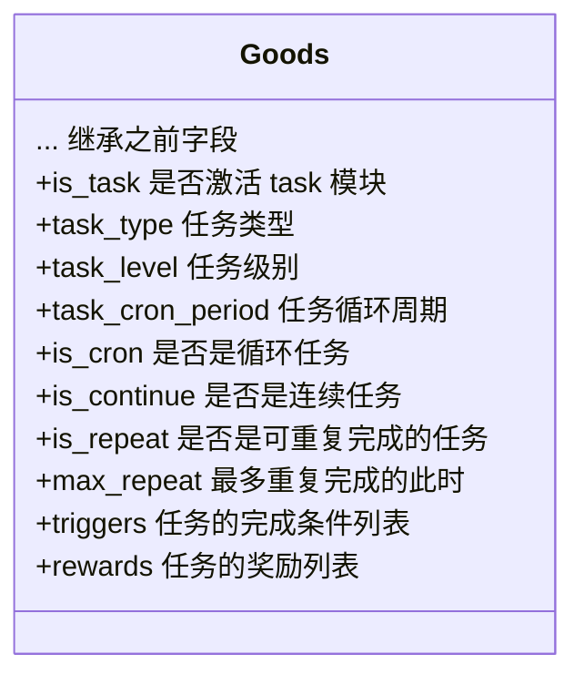

# DLC 5 - 激励 Task

本 DLC 专门为 V3 设计（Class：V，Cat：3），应用中需要如每日签到、活动参与奖励等激励任务来刺激用户更深入地参与到应用中，因此，激励模块应运而生。

一个任务最多有三级，数值越低越偏低层，代表完成后可能成为更高一级任务的一环。

| 任务级别       | task\_level 数值 |
| ---------- | -------------- |
| LevelOne   | 1              |
| LevelTwo   | 2              |
| LevelThree | 3              |

任务的循环周期分为三种：

| 名称            | 数值 | 意义   |
| ------------- | -- | ---- |
| DailyPeriod   | 1  | 每日循环 |
| WeeklyPeriod  | 2  | 每周循环 |
| MonthlyPeriod | 3  | 每月循环 |
