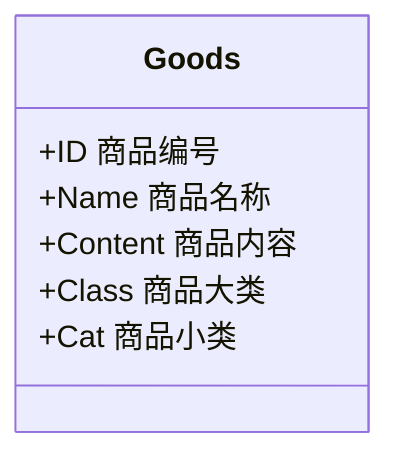
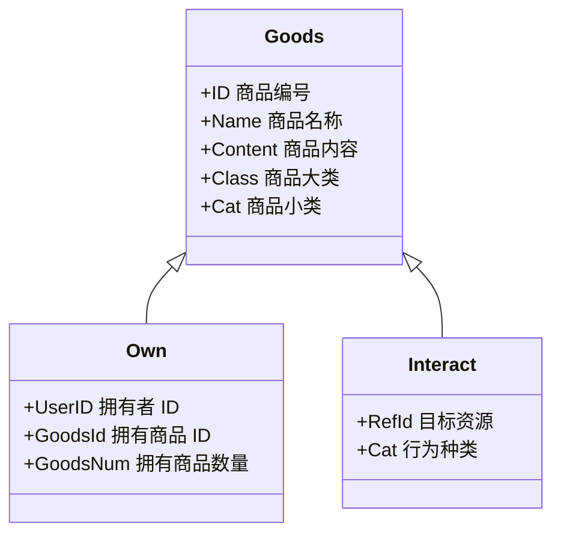

# 三元标准抽象

三元标准抽象

在深度社交协议中，一切内容，例如一场活动、一篇文章、一篇论坛帖子、会员方案等都会进行“商品-交互-拥有”三元结构抽象处理，在资源管理角度，他们被视为商品，可以确权、出售、转让。

#### DB Table - GOODS

在技术层面，所有的内容都存在一张数据库表 Goods 中，通过 ID （查单个）或 Class+Cat （查一类）进行访问。我们举个例子：当生态运营者举办一场付费活动时，该生态增加一个“商品”，数据库 Goods 这张表中，增加该场活动。

Goods 采用 Class + Cat 的二重分类法，Class 为大类，是 String 类型；Cat 是 Category 的缩写，是 Int 类型。各种分类对应表如下：

<table><thead><tr><th>Class 大类（String）</th><th width="161">Cat 小类（Int）</th><th>意义</th></tr></thead><tbody><tr><td>O (运营类，Operation)</td><td>1</td><td>活动聚会（Party/Event）</td></tr><tr><td></td><td>2</td><td>旅行（Travel）</td></tr><tr><td></td><td>3</td><td>服务（Service）</td></tr><tr><td></td><td>4</td><td>空间租赁（Space Rental）</td></tr><tr><td>C（内容类，Content）</td><td>1</td><td>笔记（Note）</td></tr><tr><td></td><td>2</td><td>帖子/评论（Post/Comment）</td></tr><tr><td></td><td>3</td><td>文章（Article）</td></tr><tr><td></td><td>4</td><td>课程（Course）</td></tr><tr><td></td><td>5</td><td>评价（Rating）</td></tr><tr><td></td><td>6</td><td>材料（Material）</td></tr><tr><td></td><td>7</td><td>问卷（Survey）</td></tr><tr><td></td><td>8</td><td>提案（Proposal）</td></tr><tr><td></td><td>9</td><td>合同（Contract）</td></tr><tr><td></td><td>10</td><td>工单（Ticket）</td></tr><tr><td>P（产品类，Product）</td><td>1</td><td>实物商品（Items）</td></tr><tr><td>V（虚拟类，Virtual）</td><td>1</td><td>会员（Membership）</td></tr><tr><td></td><td>2</td><td>点券（Points）</td></tr><tr><td></td><td>3</td><td>任务（Task）</td></tr><tr><td></td><td>4</td><td>优惠券（Coupon）</td></tr><tr><td></td><td>5</td><td>成就（Achievement）</td></tr><tr><td></td><td>6</td><td>【已废弃】 身份（Identity）</td></tr><tr><td></td><td>7</td><td>合作（Partnership）</td></tr><tr><td></td><td>8</td><td>角色（Role）</td></tr></tbody></table>

商品数据库表

#### DB Table - INTERACT

除了 Goods 表，我们可以想象，还需要记录用户与该商品的交互，例如点赞，于是我们增加 Interact 这张表。该表同样对一切用户对商品的交互进行记录：点赞、购买、收藏...

各个交互的数值表如下：

<table><thead><tr><th width="212">交互</th><th>数值</th><th>意义</th></tr></thead><tbody><tr><td>Foot</td><td>1</td><td>足迹，浏览</td></tr><tr><td>Like</td><td>2</td><td>点赞</td></tr><tr><td>Collect</td><td>3</td><td>收藏</td></tr><tr><td>Learn</td><td>4</td><td>完成学习</td></tr><tr><td>Share</td><td>5</td><td>分享</td></tr><tr><td>Comment</td><td>6</td><td>评论</td></tr><tr><td>Report</td><td>7</td><td>举报</td></tr><tr><td>Login</td><td>8</td><td>登录</td></tr><tr><td>TaskDone</td><td>9</td><td>任务完成</td></tr><tr><td>Purchase</td><td>10</td><td>购买</td></tr><tr><td>Publish</td><td>11</td><td>发布</td></tr></tbody></table>

#### DB Table - OWN

当用户购买了商品，我们需要记录用户持有该商品的数量、持有该商品的有效期等信息，于是我们再添加一张新的数据库表，Own。

Goods、Interact、Own 三张表构成了商品发布、浏览、购买、持有、消费等流程，它们之间的关系如下：

