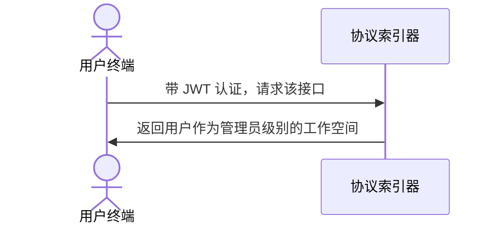
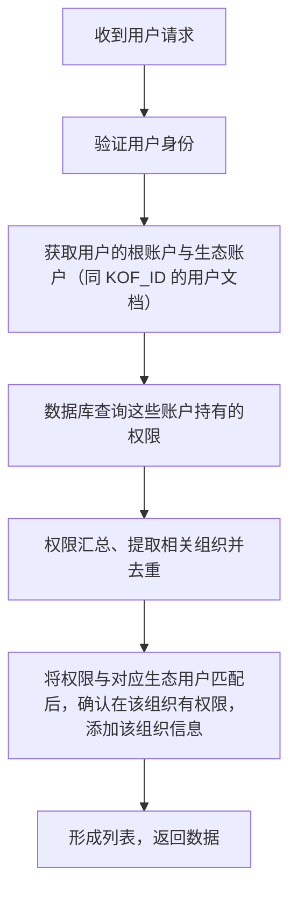

# 流程：获取用户管理空间列表

> HTTP endpoint: POST /org/admin/workspace

```mermaid
sequenceDiagram
    actor 用户终端
    用户终端->>协议索引器: 带 JWT 认证，请求该接口
    协议索引器->>用户终端: 返回用户作为管理员级别的工作空间
```

索引器收到请求后，按下列流程获取用户 Admin Workspaces:

```mermaid
graph TB
    A[收到用户请求] --> B[验证用户身份]
    B --> C[获取用户的根账户与生态账户（同 KOF_ID 的用户文档）]
    C --> D[数据库查询这些账户持有的权限]
    D --> E[权限汇总、提取相关组织并去重]
    E --> F[将权限与对应生态用户匹配后，确认在该组织有权限，添加该组织信息]
    F --> G[形成列表，返回数据]
```
